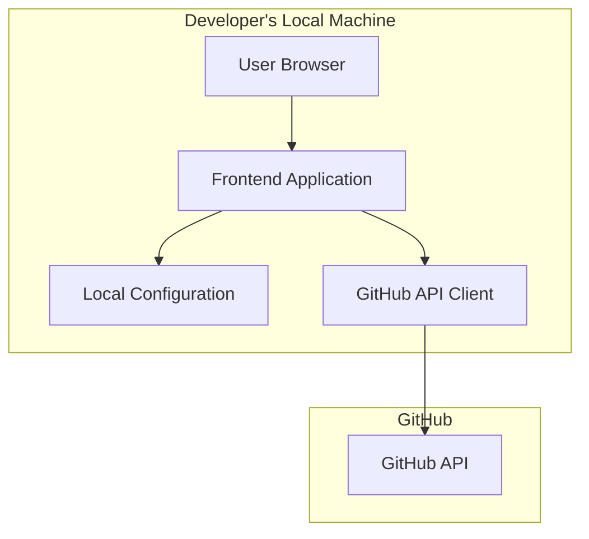

# Design Document: Developer Self-Service Portal

## Overview

The Developer Self-Service Portal (DSSP) is a web application that provides a streamlined interface for developers to interact with GitHub Actions. It offers enhanced forms with contextual information, making it easier for developers to use GitHub Actions without having to navigate the GitHub interface directly.

The portal runs locally on the developer's machine, using their GitHub token to make API calls on their behalf. It presents a curated list of GitHub Actions with improved forms and documentation, simplifying the workflow execution process.

## Architecture

The DSSP follows a client-side architecture with the following components:



### Key Architecture Decisions

1. **Client-Side Only Application**: The application runs entirely in the browser on the developer's local machine, with no server-side component required. This simplifies deployment and eliminates the need for server infrastructure.

2. **Local Configuration Storage**: GitHub tokens and user preferences are stored in local configuration files on the developer's machine, ensuring that sensitive credentials never leave their environment.

3. **Direct GitHub API Integration**: The application communicates directly with the GitHub API using the stored token, allowing it to perform actions on behalf of the developer.

4. **Static Deployment**: The application can be served as static files from any web server or file system, making it easy to deploy and distribute.

## Components and Interfaces

### 1. Core Application Components

#### 1.1 Configuration Manager

Responsible for managing the GitHub token and other user preferences.

**Interfaces:**
- `loadConfiguration()`: Loads configuration from local storage
- `saveConfiguration(config)`: Saves configuration to local storage
- `getGitHubToken()`: Retrieves the stored GitHub token
- `setGitHubToken(token)`: Stores a new GitHub token
- `clearConfiguration()`: Resets the configuration

#### 1.2 GitHub API Client

Handles all communication with the GitHub API.

**Interfaces:**
- `validateToken(token)`: Validates that a token is valid
- `getRepositories()`: Gets repositories accessible to the user
- `getWorkflows(repo)`: Gets workflows for a specific repository
- `triggerWorkflow(repo, workflow, inputs)`: Triggers a workflow with specified inputs
- `getWorkflowRuns(repo, workflow)`: Gets execution history for a workflow
- `getWorkflowRunDetails(repo, run_id)`: Gets detailed information about a workflow run
- `downloadArtifact(repo, artifact_id)`: Downloads artifacts from a workflow run

#### 1.3 Action Catalog

Manages the curated list of GitHub Actions available in the portal.

**Interfaces:**
- `getAvailableActions()`: Gets the list of curated actions
- `getActionDetails(action_id)`: Gets detailed information about a specific action
- `getActionInputSchema(action_id)`: Gets the input schema for an action
- `getActionDocumentation(action_id)`: Gets documentation for an action

#### 1.4 Form Generator

Dynamically generates enhanced forms based on GitHub Action input requirements.

**Interfaces:**
- `generateForm(action_schema)`: Creates a form based on an action's input schema
- `validateInput(input, schema)`: Validates user input against schema requirements
- `getFormValues()`: Gets all values from a form

#### 1.5 Execution Monitor

Tracks and displays the status of workflow executions.

**Interfaces:**
- `trackExecution(repo, run_id)`: Begins tracking a workflow execution
- `getExecutionStatus(repo, run_id)`: Gets the current status of an execution
- `getExecutionHistory()`: Gets history of tracked executions

### 2. User Interface Components

#### 2.1 Navigation Component

Provides navigation between different sections of the application.

#### 2.2 Action Catalog View

Displays the curated list of available GitHub Actions.

#### 2.3 Action Detail View

Shows detailed information about a selected action, including documentation and the execution form.

#### 2.4 Execution Form Component

Renders the enhanced form for configuring and triggering a GitHub Action.

#### 2.5 Execution Monitor View

Displays the status and details of current and past workflow executions.

#### 2.6 Configuration View

Allows users to manage their GitHub token and other preferences.

## Data Models

### 1. Configuration Model

```json
{
  "githubToken": "string",
  "preferences": {
    "theme": "light|dark",
    "refreshInterval": "number"
  }
}
```

### 2. Action Catalog Model

```json
{
  "actions": [
    {
      "id": "string",
      "name": "string",
      "description": "string",
      "category": "string",
      "repository": "string",
      "inputSchema": {
        "properties": {},
        "required": []
      },
      "documentation": "string"
    }
  ]
}
```

### 3. Workflow Execution Model

```json
{
  "id": "string",
  "actionId": "string",
  "repository": "string",
  "workflowId": "string",
  "status": "pending|running|completed|failed",
  "startTime": "datetime",
  "endTime": "datetime",
  "inputs": {},
  "outputs": {},
  "logs": "string",
  "artifacts": [
    {
      "id": "string",
      "name": "string",
      "size": "number",
      "downloadUrl": "string"
    }
  ]
}
```

## Error Handling

### 1. Token Validation Errors

- When a token is invalid or expired, display a clear error message and prompt for a new token.
- Provide guidance on how to generate a new GitHub token with the appropriate permissions.

### 2. API Request Errors

- Implement retry logic for transient errors.
- Display user-friendly error messages with specific guidance based on error codes.
- Log detailed error information for troubleshooting.

### 3. Form Validation Errors

- Provide inline validation feedback as users fill out forms.
- Display clear error messages next to the relevant form fields.
- Prevent form submission until all required fields are valid.

### 4. Workflow Execution Errors

- Display detailed error information when a workflow fails to execute.
- Provide links to GitHub's workflow logs for advanced troubleshooting.
- Offer suggestions for common error resolutions.

## Testing Strategy

### 1. Unit Testing

- Test individual components in isolation with mocked dependencies.
- Focus on testing business logic, validation rules, and error handling.
- Use a testing framework like Jest for JavaScript components.

### 2. Integration Testing

- Test interactions between components.
- Verify that the GitHub API client correctly interacts with the API.
- Test the form generator with various input schemas.

### 3. End-to-End Testing

- Test complete user flows from selecting an action to viewing execution results.
- Use a tool like Cypress to automate browser-based testing.
- Test with both valid and invalid inputs to verify error handling.

### 4. Mock Testing

- Create mock GitHub API responses for testing without actual API calls.
- Test error scenarios by mocking API failures.

## Security Considerations

### 1. Token Storage

- Store the GitHub token securely in the local configuration.
- Never expose the token in URLs or logs.
- Provide an option to clear the token from storage.

### 2. API Communication

- Use HTTPS for all API communication.
- Implement proper error handling to avoid exposing sensitive information.

### 3. Input Validation

- Validate all user inputs before sending them to the GitHub API.
- Sanitize inputs to prevent injection attacks.

## Future Extensibility

The design allows for future expansion to support additional APIs beyond GitHub Actions:

1. **Pluggable API Clients**: The architecture can be extended with additional API clients for other services.

2. **Extensible Action Catalog**: The catalog system can be enhanced to include actions from other platforms.

3. **Custom Action Support**: The system can be extended to allow users to define custom actions that combine multiple API calls.

4. **Workflow Templates**: Support for saving and reusing common workflow configurations.

5. **Team Sharing**: Future versions could support sharing curated actions and configurations within teams.