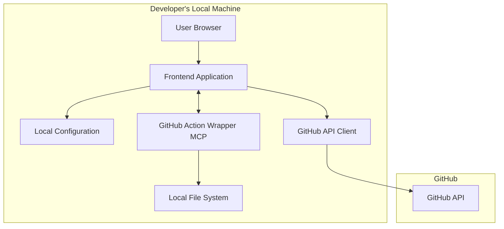
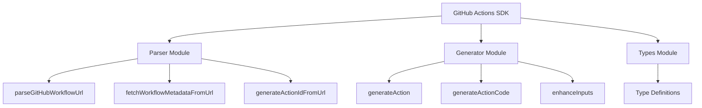
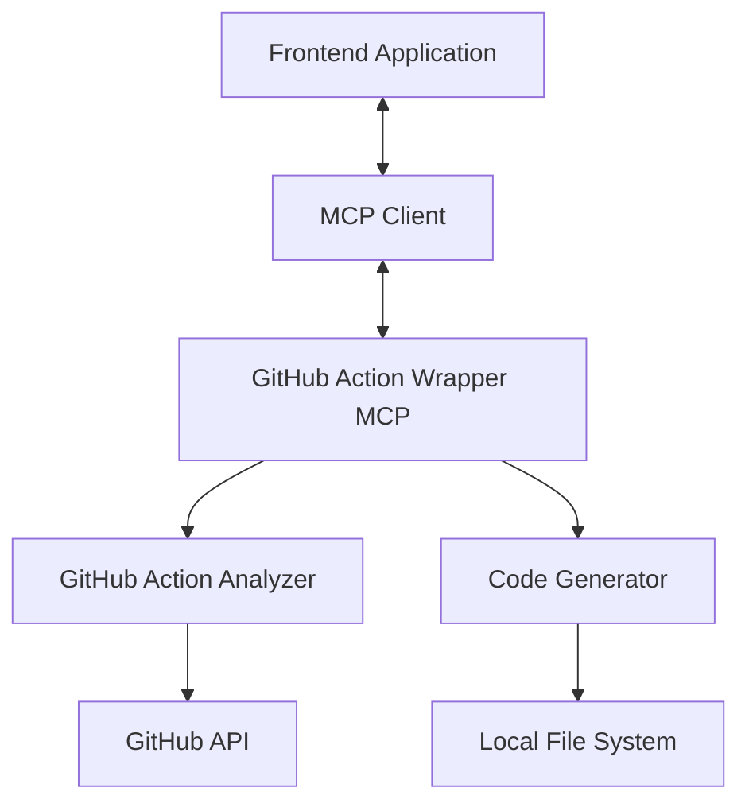

# Design Document: Developer Self-Service Portal

## Overview

The Developer Self-Service Portal (DSSP) is a web application that provides a streamlined interface for developers to interact with GitHub Actions. It offers enhanced forms with contextual information, making it easier for developers to use GitHub Actions without having to navigate the GitHub interface directly.

The portal runs locally on the developer's machine, using their GitHub token to make API calls on their behalf. It presents a curated list of GitHub Actions with improved forms and documentation, simplifying the workflow execution process. The portal focuses on providing a bespoke experience by manually adding and configuring actions with enhanced input options and contextual data that improves upon the standard GitHub interface.

Additionally, the portal integrates with a Model Context Protocol (MCP) server that enables AI-powered GitHub Action wrapping capabilities, allowing developers to easily create custom wrappers for any GitHub Action directly from the portal.

## Architecture

The DSSP follows a client-side architecture with the following components:



### Key Architecture Decisions

1. **Client-Side Application with MCP Integration**: The application runs primarily in the browser on the developer's local machine, with an integrated MCP server for AI-powered code generation. This approach combines the simplicity of a client-side application with the power of AI-assisted development.

2. **Local Configuration Storage**: GitHub tokens, user preferences, and AI API keys are stored in local configuration files on the developer's machine, ensuring that sensitive credentials never leave their environment. Another option is to store it in the browser.

3. **Direct GitHub API Integration**: The application communicates directly with the GitHub API using the stored token, allowing it to perform actions on behalf of the developer.

4. **Static Deployment with Local MCP**: The frontend application can be served as static files from any web server or file system, while the MCP server runs locally on the developer's machine, enabling AI-powered features without requiring external services.

## Components and Interfaces

### 1. Core Application Components

The application is structured around several core components that work together to provide the functionality required by the Developer Self-Service Portal.

#### 1.1 Configuration Manager

Responsible for managing the GitHub token and other user preferences.

**Interfaces:**
- `loadConfiguration()`: Loads configuration from local storage
- `saveConfiguration(config)`: Saves configuration to local storage
- `getGitHubToken()`: Retrieves the stored GitHub token
- `setGitHubToken(token)`: Stores a new GitHub token
- `clearConfiguration()`: Resets the configuration

#### 1.2 GitHub API Client

Handles all communication with the GitHub API.

**Interfaces:**
- `validateToken(token)`: Validates that a token is valid
- `getRepositories()`: Gets repositories accessible to the user
- `getWorkflows(repo)`: Gets workflows for a specific repository
- `triggerWorkflow(repo, workflow, inputs)`: Triggers a workflow with specified inputs
- `getWorkflowRuns(repo, workflow)`: Gets execution history for a workflow
- `getWorkflowRunDetails(repo, run_id)`: Gets detailed information about a workflow run
- `downloadArtifact(repo, artifact_id)`: Downloads artifacts from a workflow run

#### 1.3 Action Catalog

Manages the curated list of GitHub Actions available in the portal. Actions are manually added to the catalog with enhanced metadata and input options.

**Interfaces:**
- `getAvailableActions()`: Gets the list of curated actions
- `getActionDetails(action_id)`: Gets detailed information about a specific action
- `getActionInputSchema(action_id)`: Gets the input schema for an action
- `getActionDocumentation(action_id)`: Gets documentation for an action
- `addAction(actionDefinition)`: Manually adds a new action to the catalog
- `parseWorkflowYaml(yamlContent)`: Parses GitHub workflow YAML to extract inputs and metadata
- `updateAction(actionId, actionDefinition)`: Updates an existing action in the catalog

#### 1.4 Form Generator

Dynamically generates enhanced forms based on GitHub Action input requirements.

**Interfaces:**
- `generateForm(action_schema)`: Creates a form based on an action's input schema
- `validateInput(input, schema)`: Validates user input against schema requirements
- `getFormValues()`: Gets all values from a form

#### 1.5 Execution Monitor

Tracks and displays the status of workflow executions.

**Interfaces:**
- `trackExecution(repo, run_id)`: Begins tracking a workflow execution
- `getExecutionStatus(repo, run_id)`: Gets the current status of an execution
- `getExecutionHistory()`: Gets history of tracked executions

### 2. User Interface Components

#### 2.1 Navigation Component

Provides navigation between different sections of the application.

#### 2.2 Action Catalog View

Displays the curated list of available GitHub Actions.

#### 2.3 Action Detail View

Shows detailed information about a selected action, including documentation and the execution form.

#### 2.4 Execution Form Component

Renders the enhanced form for configuring and triggering a GitHub Action.

#### 2.5 Execution Monitor View

Displays the status and details of current and past workflow executions.

#### 2.6 Configuration View

Allows users to manage their GitHub token and other preferences.

#### 2.7 Action Wrapper Creator

Provides an interface for creating custom wrappers for GitHub Actions using the MCP integration:

- **Action URL Input**: Allows users to enter a GitHub Action URL to analyze
- **Analysis Results View**: Displays the results of the action analysis
- **Configuration Form**: Presents questions for customizing the wrapper
- **Code Preview**: Shows the generated wrapper code for review
- **Integration Controls**: Provides options for saving and integrating the wrapper

## Data Models

### 1. Configuration Model

```json
{
  "githubToken": "string",
  "preferences": {
    "theme": "light|dark",
    "refreshInterval": "number"
  }
}
```

### 2. Action Catalog Model

```json
{
  "actions": [
    {
      "id": "string",
      "name": "string",
      "description": "string",
      "category": "string",
      "repository": "string",
      "workflowPath": "string",
      "inputs": [
        {
          "name": "string",
          "description": "string",
          "required": "boolean",
          "default": "string",
          "type": "string|boolean|choice",
          "options": ["string"],
          "enhanced": {
            "type": "branch-selector|custom-select",
            "dataSource": "github-api|manual",
            "apiMethod": "string",
            "apiParams": {}
          }
        }
      ],
      "documentation": "string",
      "generatedBy": "manual|mcp",
      "generationMetadata": {
        "timestamp": "datetime",
        "mcpVersion": "string",
        "actionUrl": "string",
        "actionVersion": "string"
      }
    }
  ],
  "categories": [
    {
      "id": "string",
      "name": "string",
      "description": "string"
    }
  ],
  "metadata": {
    "lastUpdated": "string",
    "version": "string"
  }
}
```

### 3. Workflow Execution Model

```json
{
  "id": "string",
  "actionId": "string",
  "repository": "string",
  "workflowId": "string",
  "status": "pending|running|completed|failed",
  "startTime": "datetime",
  "endTime": "datetime",
  "inputs": {},
  "outputs": {},
  "logs": "string",
  "artifacts": [
    {
      "id": "string",
      "name": "string",
      "size": "number",
      "downloadUrl": "string"
    }
  ]
}
```

### 4. MCP Configuration Model

```json
{
  "mcpServer": {
    "enabled": "boolean",
    "autoStart": "boolean",
    "port": "number"
  },
  "aiProvider": {
    "name": "openai|anthropic",
    "apiKey": "string",
    "model": "string"
  },
  "codeGeneration": {
    "outputDirectory": "string",
    "defaultErrorHandling": "throw|return",
    "defaultInputValidation": "boolean",
    "defaultLogging": "boolean"
  }
}
```

### 5. Action Analysis Model

```json
{
  "name": "string",
  "description": "string",
  "inputs": {
    "inputName": {
      "description": "string",
      "required": "boolean",
      "default": "string",
      "type": "string"
    }
  },
  "outputs": {
    "outputName": {
      "description": "string",
      "value": "string"
    }
  },
  "questions": [
    {
      "id": "string",
      "question": "string",
      "type": "text|boolean|select|multiselect",
      "options": ["string"],
      "required": "boolean",
      "context": "string"
    }
  ],
  "metadata": {
    "actionUrl": "string",
    "version": "string",
    "runs": {
      "using": "string",
      "main": "string"
    }
  }
}
```

## Error Handling

### 1. Token Validation Errors

- When a token is invalid or expired, display a clear error message and prompt for a new token.
- Provide guidance on how to generate a new GitHub token with the appropriate permissions.

### 2. API Request Errors

- Implement retry logic for transient errors.
- Display user-friendly error messages with specific guidance based on error codes.
- Log detailed error information for troubleshooting.

### 3. Form Validation Errors

- Provide inline validation feedback as users fill out forms.
- Display clear error messages next to the relevant form fields.
- Prevent form submission until all required fields are valid.

### 4. Workflow Execution Errors

- Display detailed error information when a workflow fails to execute.
- Provide links to GitHub's workflow logs for advanced troubleshooting.
- Offer suggestions for common error resolutions.

## Testing Strategy

### 1. Unit Testing

- Test individual components in isolation with mocked dependencies.
- Focus on testing business logic, validation rules, and error handling.
- Use a testing framework like Jest for JavaScript components.

### 2. Integration Testing

- Test interactions between components.
- Verify that the GitHub API client correctly interacts with the API.
- Test the form generator with various input schemas.

### 3. End-to-End Testing

- Test complete user flows from selecting an action to viewing execution results.
- Use a tool like Cypress to automate browser-based testing.
- Test with both valid and invalid inputs to verify error handling.

### 4. Mock Testing

- Create mock GitHub API responses for testing without actual API calls.
- Test error scenarios by mocking API failures.

## Security Considerations

### 1. Token Storage

- Store the GitHub token securely in the local configuration.
- Never expose the token in URLs or logs.
- Provide an option to clear the token from storage.

### 2. API Communication

- Use HTTPS for all API communication.
- Implement proper error handling to avoid exposing sensitive information.

### 3. Input Validation

- Validate all user inputs before sending them to the GitHub API.
- Sanitize inputs to prevent injection attacks.

## Enhanced Action Input Features

### 1. Branch Selector Component

The portal will provide an enhanced branch selection experience that improves upon GitHub's built-in branch selector:

- **Recent Branches**: Fetches and displays a list of recently updated branches from the repository
- **Search and Filter**: Allows users to quickly search and filter branches by name
- **Branch Metadata**: Shows additional information about branches (last commit date, author, etc.)
- **Favorites**: Allows users to mark frequently used branches as favorites
- **Default Branch Indicator**: Clearly indicates the default branch of the repository

The branch selector will be implemented as a reusable component that can be used in any action form that requires branch selection. It will use the GitHub API to fetch branch information and provide a more user-friendly interface than the standard GitHub branch selector.

### 2. Enhanced Input Types

The portal will support enhanced input types that provide better user experiences:

- **Branch Selector**: As described above, provides an improved branch selection experience
- **Repository Selector**: Allows users to select from their accessible repositories
- **User Selector**: Allows users to select from organization members or collaborators
- **Date/Time Picker**: Provides a calendar and time selection interface
- **Duration Selector**: Allows users to select time durations in a user-friendly way
- **Multi-select**: Allows users to select multiple options from a list
- **Conditional Inputs**: Shows or hides inputs based on the values of other inputs

### 3. Dynamic Data Sources

Input options can be populated from various sources:

- **GitHub API**: Fetches data directly from GitHub API (branches, repositories, users, etc.)
- **Manual Configuration**: Manually defined options in the action definition
- **Computed Values**: Options generated based on other inputs or context
- **External APIs**: Data from other systems or services (future enhancement)

## GitHub Actions SDK

To streamline the process of integrating GitHub Actions into the Developer Self-Service Portal, we've developed a dedicated SDK that provides utilities for parsing, generating, and enhancing GitHub Actions.

### 1. SDK Architecture

The GitHub Actions SDK consists of three main modules:



#### 1.1 Parser Module

The Parser module provides utilities for parsing GitHub workflow URLs and files:

- **parseGitHubWorkflowUrl**: Parses a GitHub workflow URL and extracts the owner, repo, and path
- **fetchWorkflowMetadataFromUrl**: Fetches workflow metadata from a GitHub URL
- **generateActionIdFromUrl**: Generates a unique ID from a GitHub workflow URL

#### 1.2 Generator Module

The Generator module provides utilities for generating action definitions and form components:

- **generateAction**: Generates an action definition from workflow metadata
- **generateActionCode**: Generates all code for an action (definition, form component, registration)
- **enhanceInputs**: Enhances inputs with UI components based on their type and name
- **generateTags**: Generates tags for an action based on its metadata
- **generateDocumentation**: Generates documentation for an action

#### 1.3 Types Module

The Types module provides type definitions for the SDK:

- **ParsedWorkflowUrl**: Parsed components of a GitHub workflow URL
- **WorkflowMetadata**: Workflow metadata extracted from a workflow file
- **ActionGenerationOptions**: Options for generating an action from a workflow
- **ActionGenerationResult**: Result of generating an action from a workflow

### 2. Integration Workflow

The SDK enables a streamlined workflow for integrating GitHub Actions:

1. **URL Parsing**: Parse a GitHub workflow URL to extract owner, repo, and path
2. **Metadata Fetching**: Fetch workflow metadata using the GitHub API
3. **Action Generation**: Generate an action definition with enhanced inputs
4. **Code Generation**: Generate form components and registration code
5. **Integration**: Add the generated code to the application

### 3. Enhanced Input Detection

The SDK automatically detects and enhances inputs based on their type and name:

- **Branch Inputs**: Inputs with "branch" in the name are enhanced with a branch selector
- **Repository Inputs**: Inputs with "repo" in the name are enhanced with a repository selector
- **User Inputs**: Inputs with "user" in the name are enhanced with a user selector
- **Date Inputs**: Inputs with "date" in the name are enhanced with a date picker
- **Duration Inputs**: Inputs with "duration" in the name are enhanced with a duration selector
- **Boolean Inputs**: Boolean inputs are enhanced with a conditional component
- **Choice Inputs**: Inputs with options are enhanced with a multi-select component

## Manual Action Creation Approach

The Developer Self-Service Portal takes a bespoke approach to action creation, focusing on quality over quantity:

### 1. Action Definition Process

1. **YAML Analysis**: The system parses GitHub workflow YAML files to extract basic input structure
2. **Manual Enhancement**: Developers manually enhance the extracted inputs with additional metadata
3. **Input Type Customization**: Standard inputs can be upgraded to enhanced input types (e.g., converting a branch text input to a branch selector)
4. **Documentation Integration**: Custom documentation can be added to provide context and guidance
5. **Code Generation**: The SDK generates all necessary code for integration

### 2. Action Catalog Management

- **Selective Inclusion**: Only carefully selected and enhanced actions are added to the catalog
- **Quality over Quantity**: Focus on providing high-quality, well-documented actions rather than comprehensive coverage
- **Iterative Enhancement**: Actions can be continuously improved based on user feedback and usage patterns
- **URL-Based Integration**: Actions can be quickly integrated by providing a GitHub workflow URL

### 3. Example: QA Build Action

The QA Build action (qa-build.yaml) serves as an example of this approach:

1. **Initial Parsing**: The system extracts the basic input structure from the workflow YAML
2. **Branch Input Enhancement**: The standard branch input is enhanced with a custom branch selector component
3. **Purpose Clarification**: The action's purpose is clearly documented - creating QA environments from selected branches
4. **Input Guidance**: Each input field includes clear guidance on its purpose and impact
5. **Code Generation**: The SDK generates all necessary code for the action

This approach ensures that the Developer Self-Service Portal provides a truly enhanced experience compared to the standard GitHub interface, with carefully crafted actions that are tailored to the specific needs of the development team.

## GitHub Action Wrapper MCP Integration

The Developer Self-Service Portal integrates with a Model Context Protocol (MCP) server that provides AI-powered GitHub Action wrapping capabilities. This integration enables developers to easily create custom wrappers for any GitHub Action directly from the portal.

### 1. MCP Architecture

The GitHub Action Wrapper MCP is a standalone server that runs locally on the developer's machine. It communicates with the frontend application through the Model Context Protocol, providing tools for analyzing GitHub Actions and generating wrapper code.



### 2. MCP Components

#### 2.1 GitHub Action Analyzer

The GitHub Action Analyzer is responsible for fetching and analyzing GitHub Action metadata:

- **Fetches action.yml/action.yaml**: Retrieves the action definition file from GitHub
- **Parses inputs and outputs**: Extracts input and output definitions from the action
- **Generates analysis questions**: Creates a set of questions to guide the wrapper configuration
- **Provides metadata insights**: Analyzes the action to provide insights for better wrapping

#### 2.2 Code Generator

The Code Generator creates wrapper code based on the analysis and user configuration:

- **Generates JavaScript/TypeScript code**: Creates wrapper functions for GitHub Actions
- **Enhances input handling**: Adds validation, default values, and type checking
- **Implements error handling**: Adds robust error handling based on user preferences
- **Creates documentation**: Generates JSDoc comments and usage examples
- **Integrates with the portal**: Ensures the generated code works seamlessly with the portal

### 3. MCP Integration Workflow

The integration workflow follows these steps:

1. **Action Selection**: User selects a GitHub Action to wrap
2. **Analysis**: MCP analyzes the action and generates configuration questions
3. **Configuration**: User answers questions to customize the wrapper
4. **Code Generation**: MCP generates wrapper code based on the configuration
5. **Integration**: Generated code is saved to the local file system and integrated with the portal

### 4. MCP Configuration

The MCP server requires configuration for API keys and other settings:

```json
{
  "aiProvider": "openai|anthropic",
  "apiKey": "string",
  "outputDirectory": "string",
  "defaultOptions": {
    "errorHandling": "throw|return",
    "inputValidation": "boolean",
    "logging": "boolean"
  }
}
```

### 5. Security Considerations

- **Local Execution**: The MCP server runs locally, ensuring that sensitive information never leaves the developer's machine
- **API Key Storage**: API keys are stored securely in the local configuration
- **Code Review**: Generated code is presented for review before integration
- **Sandboxed Execution**: The MCP server runs in a sandboxed environment

## Future Extensibility

The design allows for future expansion to support additional APIs beyond GitHub Actions:

1. **Pluggable API Clients**: The architecture can be extended with additional API clients for other services.

2. **Extensible Action Catalog**: The catalog system can be enhanced to include actions from other platforms.

3. **Custom Action Support**: The system can be extended to allow users to define custom actions that combine multiple API calls.

4. **Workflow Templates**: Support for saving and reusing common workflow configurations.

5. **Team Sharing**: Future versions could support sharing curated actions and configurations within teams.

6. **Action Creation UI**: A future enhancement could include a graphical interface for creating and enhancing actions.

7. **Enhanced AI Integration**: Future versions could leverage more advanced AI capabilities for code generation, documentation, and troubleshooting.